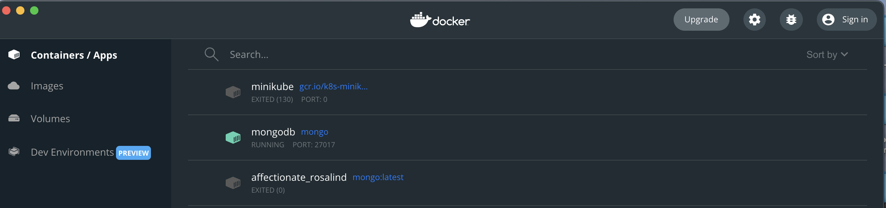

# Backend práctica SCE
El siguiente proyecto forma parte del Backend de la asignatura SCE (Sistemas de comercio electrónico) de la Universidad Rovira i Virgili 4º curso.
Mediante diferentes rutas, podemos realizar diferentes acciones, tanto para obtener la información de un servicio como realizar una compra.

## Instalación
El Backend se ha creado utilizando Node.js, por lo tanto, tenemos que tener [Node.js](https://nodejs.org/en/ "Node.js")  instalado.

A la hora de guardar los datos, utilizamos una Base de datos no relacional, en este caso, MongoDB.

Recomendamos tener Docker instalado y de esta forma, solo tenemos que bajarnos la siguiente Imagen [Mongo](https://hub.docker.com/_/mongo "Mongo").

En caso de necesitar un cliente para manejar nuestra BD, podemos instalar [Mongo atlas](https://www.mongodb.com/es/cloud/atlas/efficiency "Mongo Atlas"). 

## Datos prueba
Para disponer de datos de prueba, en la raíz del proyecto tenemos un fichero **te.json**, el cual contiene datos de ejemplo para insertar en nuetsra BD.

## Arrancar el servidor
Para lanzar la aplicación servidor, mediante terminal, tenemos que situarnos en el proyecto y ejecutar la siguiente comanda:
`npm run dev`