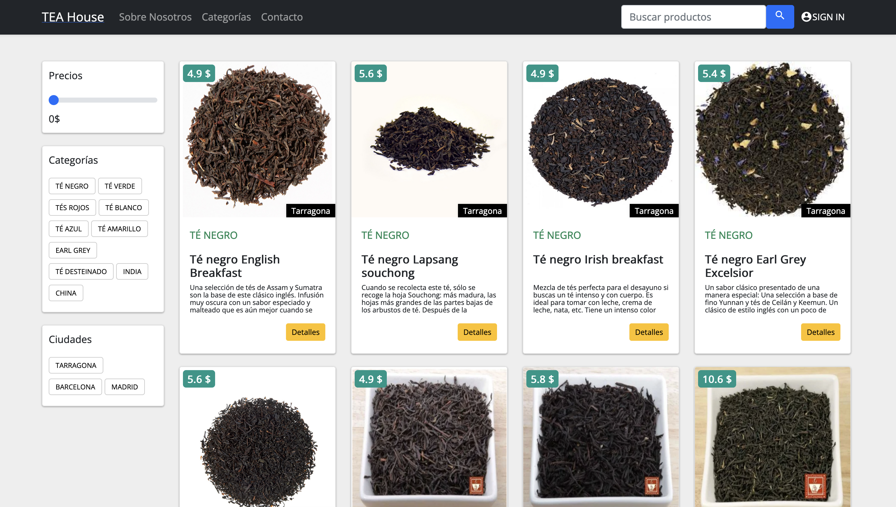
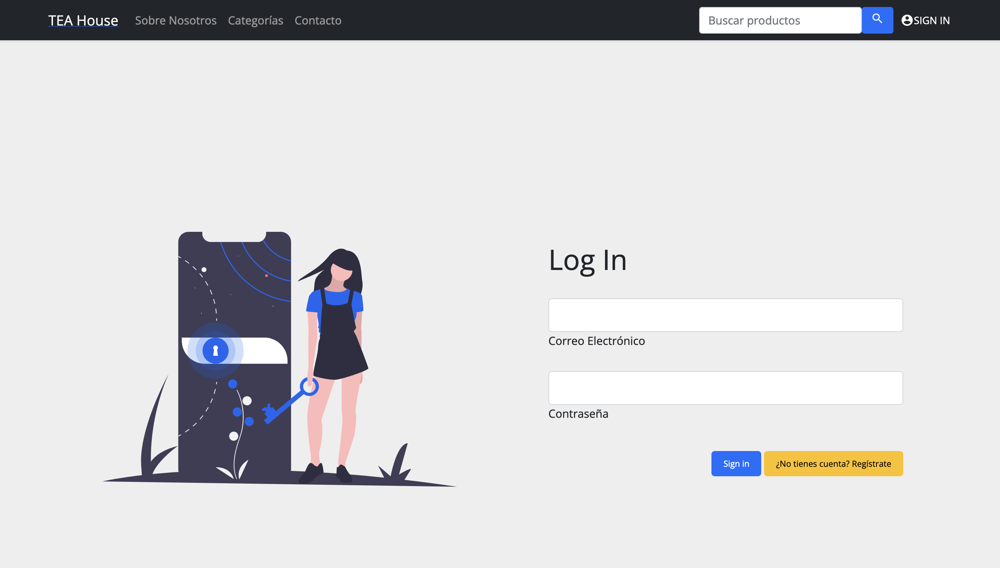
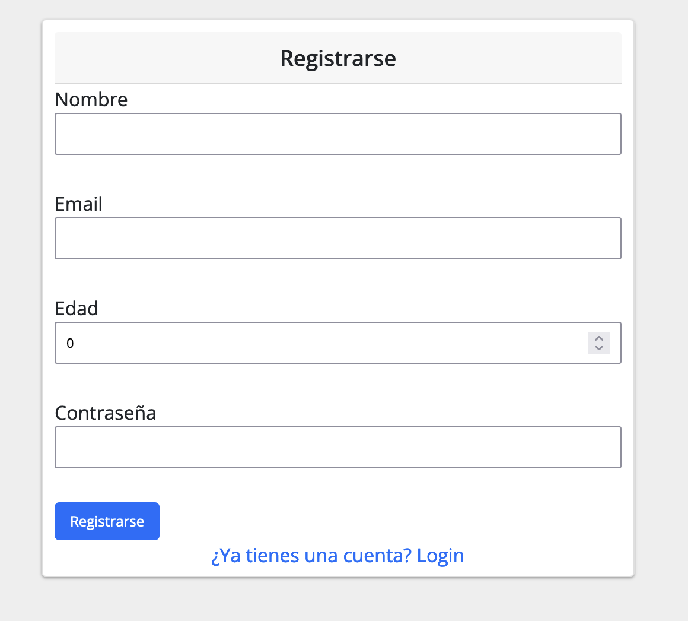
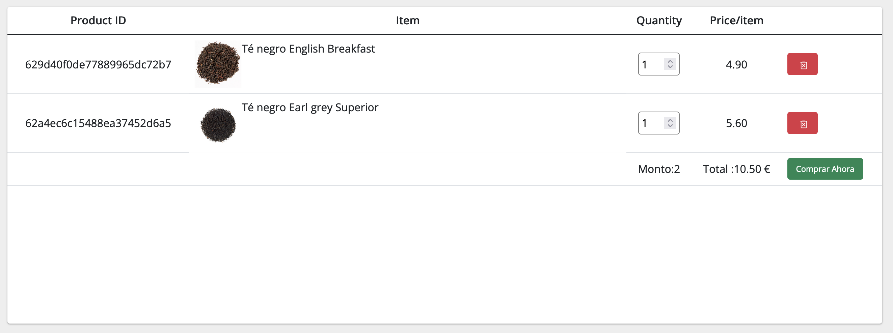

# e-commerce-vue
Para la creación de este Frontend, hemos utilizado el Frameword Vue.

> **_NOTA:_**  Se debe tener instalado Node.js en la versión v14.20.0


En caso de tener Node en versión posterior, podemos utilizar Node Version Manager => [nvm](https://github.com/nvm-sh/nvm "nvm") 


## Project setup
```
npm install
```

### Compiles and hot-reloads for development
```
npm run serve
```

### Compiles and minifies for production
```
npm run build
```
### ScreenShot







